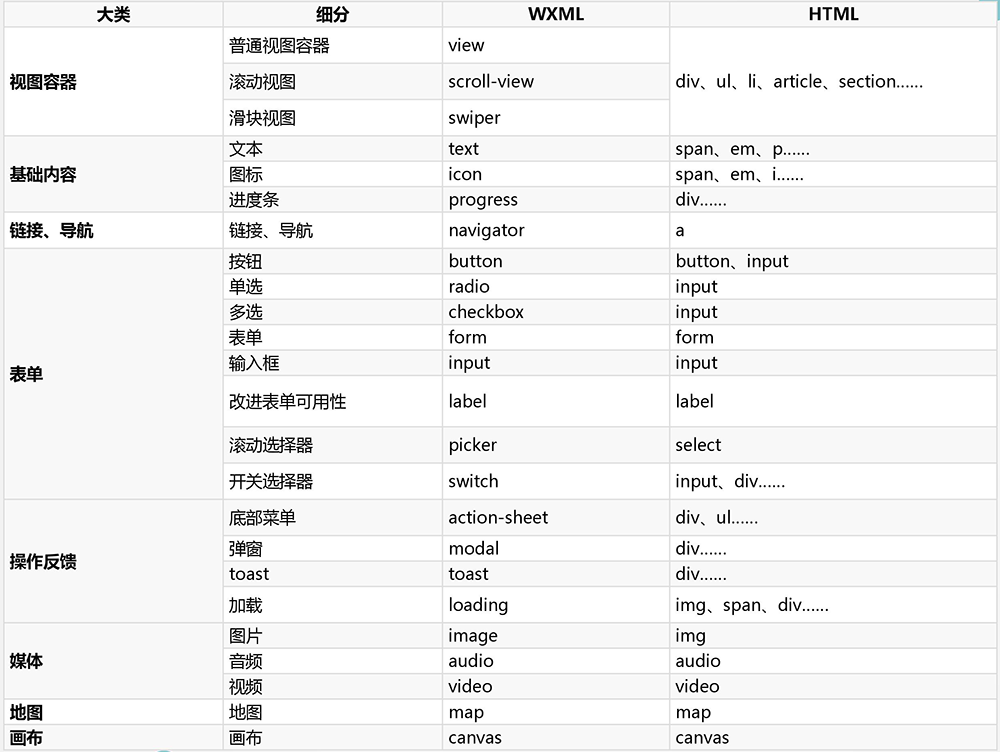
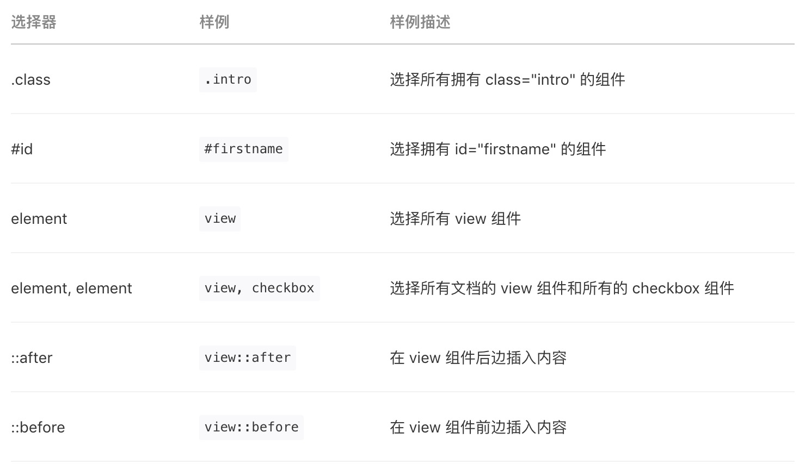
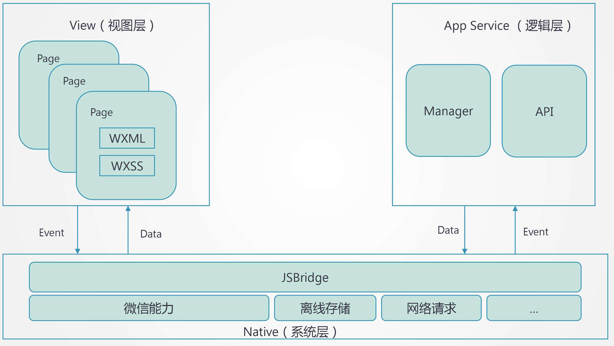
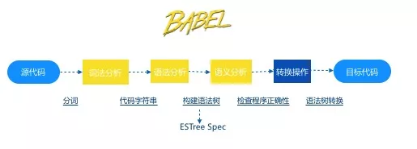
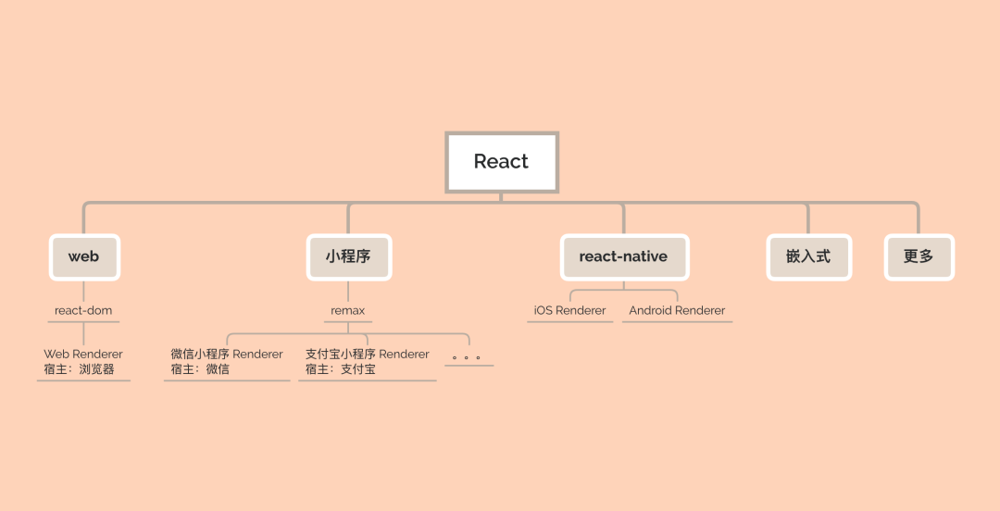
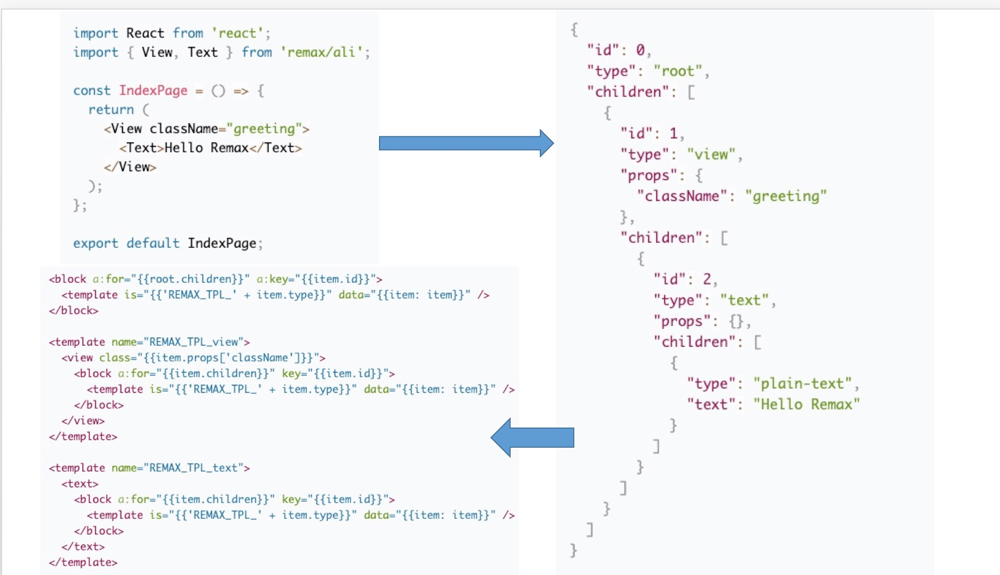

# 微信小程序开发

<style scoped>h1 { text-align: center; }</style>
<style>img { margin:0  auto; display:block; }</style>

---

## 小程序介绍


- 类 WEB 不是 HTML5
- 基于微信 跨平台
- 媲美原生操作体验（语音，摄像头，地理定位...）
- 连接微信生态（用户信息，社交化，微信支付...）

---

## 开发准备

- [注册一个 AppID](https://mp.weixin.qq.com/)
- [下载微信开发者工具](https://developers.weixin.qq.com/miniprogram/dev/devtools/download.html)
- [官方文档](https://developers.weixin.qq.com/miniprogram/dev/framework/)

---

## 目录结构

```bash
|- app.json
|- app.js
|- pages
   |- home
      |- home.wxml
      |- home.js
```

---

## 小程序代码构成

- JSON 配置文件
- WXML 模板文件
- WXSS 样式文件
- JS 脚本逻辑文件

---

## JSON 配置文件

```json
{
  "pages": ["pages/index/index", "pages/logs/index"],
  "window": {
    "navigationBarTitleText": "Demo"
  },
  "tabBar": {
    "list": [
      {
        "pagePath": "pages/index/index",
        "text": "首页"
      },
      {
        "pagePath": "pages/logs/logs",
        "text": "日志"
      }
    ]
  },
  "networkTimeout": {
    "request": 10000,
    "downloadFile": 10000
  },
  "debug": true
}
```

---

## WXML 模板文件



---

## WXSS 样式文件

### 选择器



---

### 尺寸单位

- rpx（responsive pixel）: 可以根据屏幕宽度进行自适应。规定屏幕宽为 750rpx。如在 iPhone6 上，屏幕宽度为 375px，共有 750 个物理像素，则 750rpx = 375px = 750 物理像素，1rpx = 0.5px = 1 物理像素。

---

## 小程序架构



<style scoped>img { margin:0  auto; display:block; }</style>

---

## Todo app Demo

- 页面生命周期
- 事件绑定
- 网络请求
- 小程序登陆
- 自定义组件
  - 组件生命周期
  - 父子组件通讯

---

## 页面生命周期

```
Page({
  data: {
    text: "This is page data."
  },
  onLoad: function(options) {
    // 页面创建时执行
  },
  onShow: function() {
    // 页面出现在前台时执行
  },
  onReady: function() {
    // 页面首次渲染完毕时执行
  },
  onHide: function() {
    // 页面从前台变为后台时执行
  },
  onUnload: function() {
    // 页面销毁时执行
  },
  onPullDownRefresh: function() {
    // 触发下拉刷新时执行
  },
  onReachBottom: function() {
    // 页面触底时执行
  },
  onShareAppMessage: function () {
    // 页面被用户分享时执行
  },
  onPageScroll: function() {
    // 页面滚动时执行
  },
  onResize: function() {
    // 页面尺寸变化时执行
  },
  onTabItemTap(item) {
    // tab 点击时执行
    console.log(item.index)
    console.log(item.pagePath)
    console.log(item.text)
  },
  // 事件响应函数
  viewTap: function() {
    this.setData({
      text: 'Set some data for updating view.'
    }, function() {
      // this is setData callback
    })
  },
  // 自由数据
  customData: {
    hi: 'MINA'
  }
})
```

---

## 组件生命周期

```js
Component({

  behaviors: [],

  properties: {
    myProperty: { // 属性名
      type: String,
      value: ''
    },
    myProperty2: String // 简化的定义方式
  },

  data: {}, // 私有数据，可用于模板渲染

  lifetimes: {
    // 生命周期函数，可以为函数，或一个在methods段中定义的方法名
    attached: function () { },
    moved: function () { },
    detached: function () { },
  },

  // 生命周期函数，可以为函数，或一个在methods段中定义的方法名
  attached: function () { }, // 此处attached的声明会被lifetimes字段中的声明覆盖
  ready: function() { },

  pageLifetimes: {
    // 组件所在页面的生命周期函数
    show: function () { },
    hide: function () { },
    resize: function () { },
  },

  methods: {}
}
```

---

## 事件绑定

```html
<view id="tapTest" data-hi="Weixin" bindtap="tapName"> Click me! </view>
```

```js
Page({
  tapName: function (event) {
    console.log(event)
  },
})
```

---

## event log 信息

```
{
  "type":"tap",
  "timeStamp":895,
  "target": {
    "id": "tapTest",
    "dataset":  {
      "hi":"Weixin"
    }
  },
  "currentTarget":  {
    "id": "tapTest",
    "dataset": {
      "hi":"Weixin"
    }
  },
  "detail": {
    "x":53,
    "y":14
  }
}
```

---

## 小程序登陆

通过微信提供的用户身份标识，快速建立小程序内的用户体系。


---

## 云开发 CloudBase

[云开发 CloudBase](https://console.cloud.tencent.com/tcb/env/access?rid=4)

Koa 初始化应用示例

```
cloudbase init --template koa-starter
```

本地开发

```
npm run dev
```

上线部署

```
npm run deploy
```

查看 [CloudBase Framework 配置](https://github.com/TencentCloudBase/cloudbase-framework).

---

## 微信小程序开发完成了——“累”

## 我还想支持其他平台怎么办?——“学不动了”

（H5、原生 APP、支付宝、钉钉、百度...）

---

## 是否可以"一次编写，多端运行 ？"

---

## 多端开发框架

- taro，京东凹凸实验室出品，[官网地址](http://taro.jd.com/)
- uni-app，DCloud 团队出品，[官网地址](http://niapp.dcloud.net.cn)
- kbone，腾讯微信团队出品，[官网地址](http://wechat-miniprogram.github.io/kbone/docs/)
- remax，阿里团队出品，[官网地址](https://remaxjs.org/)

[uni-app 作者测评地址](https://github.com/dcloudio/test-framework)
[taro 作者测评地址](https://developers.weixin.qq.com/community/develop/article/doc/000eaadb944de06374485c3ed51813)

---

## 实现原理

- taro2
  
  有过 Babel 插件开发经验的应该对一下流程十分熟悉，Taro 的编译时也是遵循了此流程，使用 [babel-parser](https://babeljs.io/docs/en/babel-parser) 将 Taro 代码解析成抽象语法树，然后通过 [babel-types](https://babeljs.io/docs/en/babel-types) 对抽象语法树进行一系列修改、转换操作，最后再通过 [babel-generate](https://babeljs.io/docs/en/babel-generator) 生成对应的目标代码。

---

## 演示 taro 项目 demo

### taro2 特点

- 重编译时，轻运行时：这从两边代码行数的对比就可见一斑
- 编译后代码与 React 无关：Taro 只是在开发时遵循了 React 的语法。
- 直接使用 Babel 进行编译：这也导致当前 Taro 在工程化和插件方面的羸弱。

---

## 用 react 写 Web 、可以写小程序 、可以写原生应用



---

## Remax 实现原理

Remax 的运行时本质是一个通过 react-reconciler 实现的一个小程序端的渲染器



---

## 扩展阅读

- [《史上最贴心 React 渲染器开发辅导》](https://cloud.tencent.com/developer/article/1664392)
- [《小程序跨框架开发的探索与实践》](https://aotu.io/notes/2020/01/02/gmtc/index.html)
- [《Remax 实现原理》](https://remaxjs.org/guide/implementation-notes)

---

## 总结和思考
